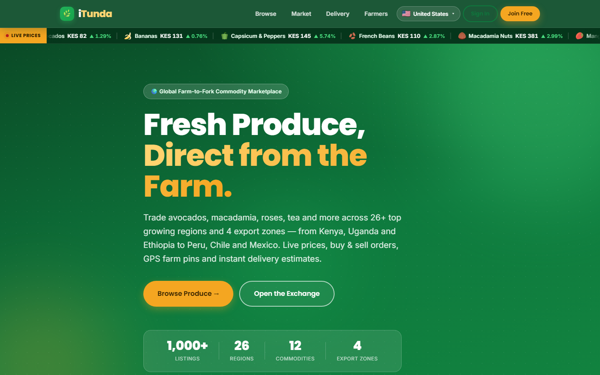
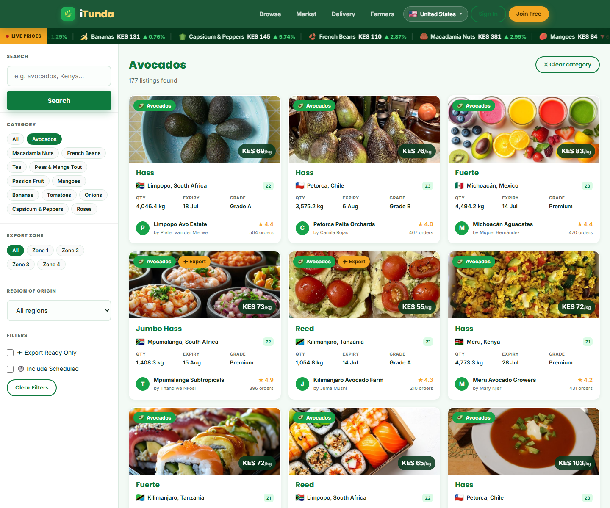
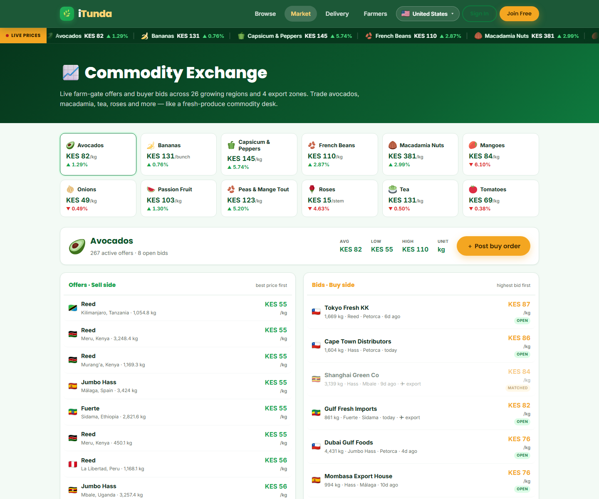
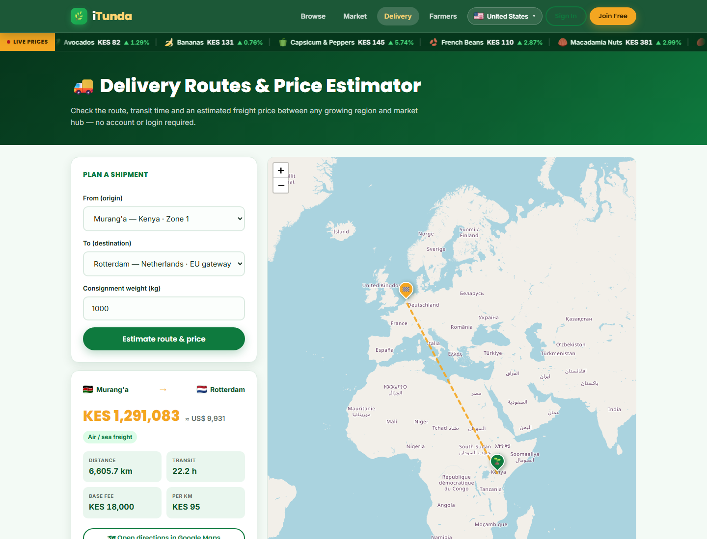
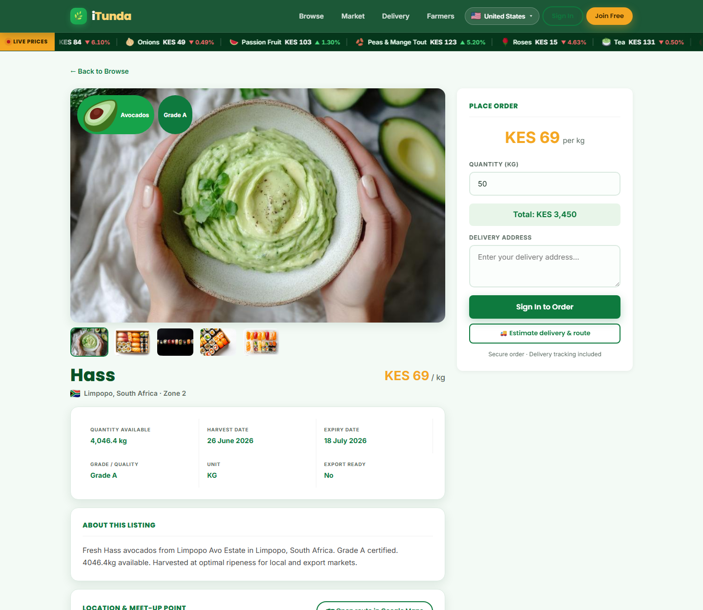
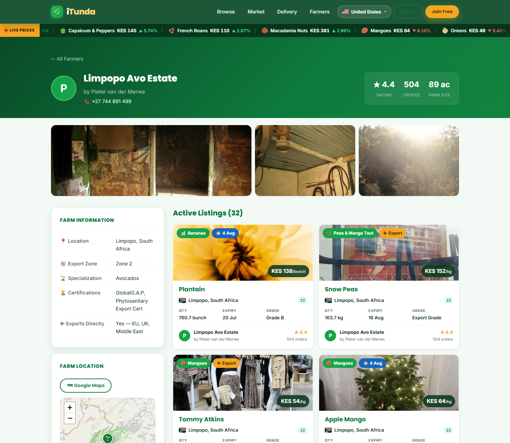
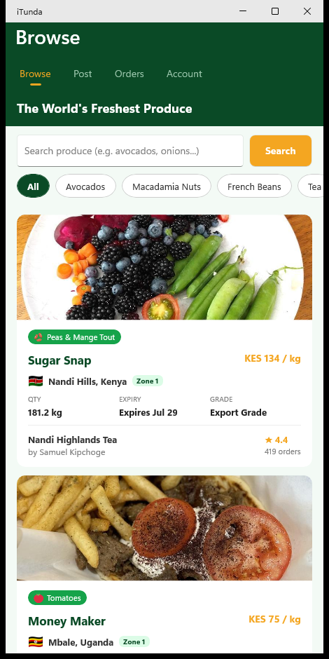
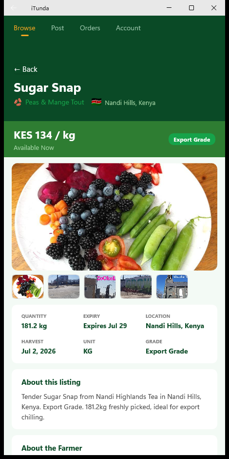

# 🌿 iTunda — Global Farm-to-Fork Commodity Marketplace

**iTunda** connects farmers directly with grocery stores, exporters and restaurants — trading
avocados, macadamia, roses, tea and more like a fresh-produce commodity desk. Browse 1,000+ live
listings across **26 top growing regions** and **4 export zones** — from Kenya, Uganda and Ethiopia
to Peru, Chile and Mexico — with live prices, buy & sell orders, GPS farm pins and instant delivery
estimates.

> Fresh produce, direct from the farm. 🌍

**Live:** [itunda.org](https://itunda.org) · ASP.NET Core 8 API + React (Vite) web + .NET MAUI app

---

## ✨ Web app

A responsive white-on-green React SPA served by IIS behind Cloudflare, with a live commodity price
ticker, flag-based region/zone selector, interactive Leaflet maps and a full order book.

| Home | Browse |
| --- | --- |
|  |  |

| Commodity Exchange | Delivery Route Estimator |
| --- | --- |
|  |  |

| Produce detail (gallery + farm pins) | Farmer profile (farm photos + map) |
| --- | --- |
|  |  |

## 📱 Mobile app (.NET MAUI)

Cross-platform (Windows / Android / iOS / macOS) native app sharing the same API — with fruit icons,
produce photo galleries, country flags, export-zone chips and open-in-Google-Maps meet-up points.

| Browse | Produce detail |
| --- | --- |
|  |  |

---

## 🚀 Feature highlights

- **Commodity exchange** — a forex-style order book with live **buy orders (bids)** and farm-gate
  **offers (asks)** per commodity, plus average / low / high price summaries.
- **Live price ticker** — a scrolling under-header ticker of daily commodity prices and % change.
- **Regions & export zones** — 26 curated growing regions grouped into 4 export zones, with a
  flag-based region selector (auto-detects the visitor's country) that filters the whole app.
- **Interactive maps** — real Leaflet pins for farms, suggested meet-up points and regional hubs,
  each opening turn-by-turn directions in Google Maps.
- **Delivery estimator** — check routes, transit time and freight price between any region and
  market hub, **no login required** (OSRM road routing + great-circle freight lines).
- **Rich imagery** — every listing has a hero photo + gallery and a per-category fruit icon;
  farmer profiles show photos of the growing region.
- **Deep links** — both `/browse/Avocados` and `/browse?category=Avocados` resolve to the same view.

---

## 🧱 Repository structure

```
iTunda/
├── iTunda.Api/   ASP.NET Core 8 Web API (EF Core + SQLite, JWT auth)
├── iTunda.App/   .NET MAUI app (Windows / Android / iOS / macOS)
├── iTunda.Web/   React 19 + Vite + TypeScript SPA
└── iTunda.sln
```

### Tech stack

- **API** — ASP.NET Core 8, EF Core (SQLite), JWT bearer auth, BCrypt, Swagger. Seeds ~1,000
  produce listings + buy orders across 26 farmers/regions and 12 export categories on first run.
- **Web** — React 19, Vite, TypeScript, React Router, Axios, Leaflet (maps), FlagCDN (flags).
- **App** — .NET MAUI (net10.0), C# code-behind UI, shared REST client.
- **Design** — white-on-green brand system, Poppins + Inter, harvest-gold accent.

### Key API endpoints

| Endpoint | Auth | Purpose |
| --- | --- | --- |
| `GET /api/produce` | public | Listings, filterable by `category`, `region`, `country`, `zone`, `exportReady` |
| `GET /api/regions` | public | Growing regions + export zones with live listing counts |
| `GET /api/commodities` | public | Price board (avg / low / high / daily change) for the ticker |
| `GET /api/buyorders` · `POST /api/buyorders` | public | Read / post commodity buy orders (bids) |
| `POST /api/delivery/estimate` | public | Route distance, ETA and freight price between two points |

---

## 🎨 Design system

Fresh farm palette — deep forest greens with a harvest-gold call-to-action.

| Token | Value | Use |
| --- | --- | --- |
| Primary green | `#0E7A3E` | Buttons, headings |
| Deep green | `#0A4A26` | Nav bar, hero, footer |
| Fresh green | `#16A34A` | Highlights, links |
| Harvest gold | `#F4A621` | Primary CTAs, prices |
| Page tint | `#F3FAF5` | Backgrounds |

Fonts: **Poppins** (headings) + **Inter** (body).

---

## 🚀 Local development

### Prerequisites
- .NET 10 SDK (with the `maui` workloads for the app)
- Node.js 20+

### 1. API
```bash
cd iTunda.Api
dotnet run
# → http://localhost:5041 (Swagger at /swagger). SQLite DB + seed data are created automatically.
```

### 2. Web
```bash
cd iTunda.Web
npm install
npm run dev
# → http://localhost:3000  (Vite proxies /api → the local API)
```

### 3. Mobile app (Windows)
```bash
cd iTunda.App
dotnet build -f net10.0-windows10.0.19041.0
# or open iTunda.sln in Visual Studio and run the iTunda.App (Windows Machine) target
```
Demo login (any seeded account, password `Password123!`):
`james.kamau@farm.ke` (farmer) · `orders@nairobifresh.ke` (buyer).

---

## 🌐 Production hosting (this server)

iTunda is deployed on IIS (Windows Server) behind Cloudflare, following the same pattern as
the other sites on the box:

- **API** runs as a Windows service (`itunda-api`, via NSSM) on `http://127.0.0.1:5088`.
- **Web** is built with Vite (`dist/`) and served by the IIS site `itunda.org` from
  `C:\inetpub\wwwroot\itunda.org`.
- `iTunda.Web/public/web.config` gives the SPA a fallback route and **proxies `/api` → the
  API service**, so the browser only ever talks to `https://itunda.org`.

Rebuild and redeploy the web app at any time with:

```powershell
# from the repo root
powershell -File publish.ps1          # build + deploy to wwwroot
powershell -File publish.ps1 -Install  # also refresh npm dependencies
```

To (re)publish the API service:

```powershell
dotnet publish iTunda.Api -c Release -r win-x64 --self-contained true -o C:\inetpub\apps\itunda-api
nssm restart itunda-api
```

---

## 📄 License

© iTunda — Global Farm-to-Fork Commodity Marketplace.
